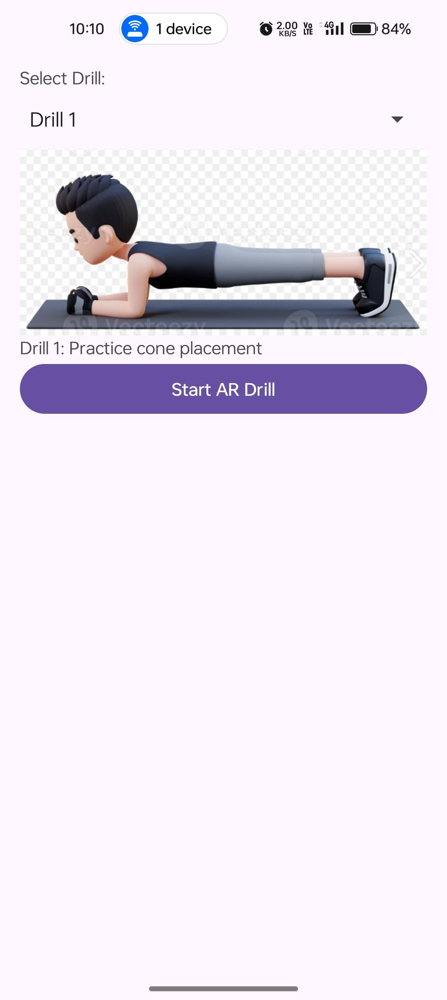
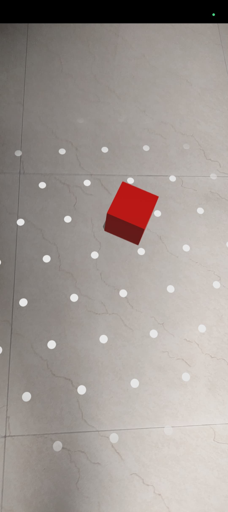

\# AR Cube App 🧊📱

This is an Augmented Reality (AR) Android application that allows users to place a virtual cube on a horizontal surface using ARCore and Sceneform. The cube is rendered in 3D and can be interacted with in real time.

---

\## ✨ Features

\- 📷 Detects horizontal surfaces (planes) in the real world using ARCore.

\- 🧱 Places a red 3D cube where the user taps.

\- 🔁 Replaces the cube if another location is tapped.

\- 🧭 Tap gesture recognition and object anchoring with `TransformableNode`.

---

## 📷 Screenshots

### 👇 Drill Selector  

### 🧱 Floor Detection  

### 🔷 AR Cube Placement  

---

\## 📁 Project Structure

