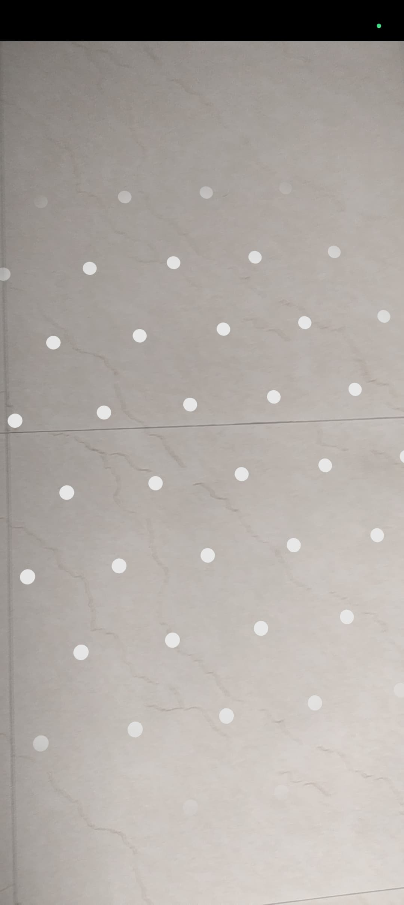

# AR Cube App 🧊📱

This is an Augmented Reality (AR) Android application that allows users to place a virtual cube on a horizontal surface using ARCore and Sceneform. The cube is rendered in 3D and can be interacted with in real time.

---

## ✨ Features

- 📷 Detects horizontal surfaces (planes) in the real world using ARCore.  
- 🧱 Places a red 3D cube where the user taps.  
- 🔁 Replaces the cube if another location is tapped.  
- 🧭 Tap gesture recognition and object anchoring with `TransformableNode`.

---

## 📷 Screenshots

### 👇 Drill Selector  

### 🧱 Floor Detection  

### 🔷 AR Cube Placement  

---

## 📁 Project Structure

InternProjectDemoArApp/
├── .idea/ # Android Studio project configs
├── app/ # Main application module
│ ├── src/
│ │ └── main/
│ │ └── java/
│ │ └── com/example/internprojectdemoarapp/
│ │ ├── MainActivity.java
│ │ └── ARActivity.java
├── gradle/ # Gradle wrapper files
├── screenshots/ # Screenshots used in README
│ ├── img1.jpg
│ ├── img2.jpg
│ └── img3.jpg
├── .gitignore # Git ignore file
├── build.gradle.kts # Project-level Gradle build file
├── gradle.properties # Gradle properties
├── gradlew # Gradle wrapper script (Unix)
├── gradlew.bat # Gradle wrapper script (Windows)
├── local.properties # SDK location and local settings
├── README.md # Project documentation
└── settings.gradle.kts # Gradle settings file
